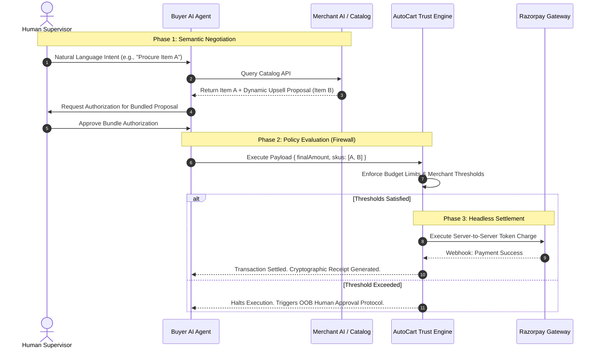

# AutoCart: Autonomous Agentic Commerce Protocol

**Razorpay AI Buildathon — Track 1: AI Growth & Agentic Commerce**

AutoCart is a headless, B2B2C agentic commerce protocol designed to facilitate secure, zero-intervention transactions between buyer-side LLM agents and merchant-side AI systems. By bridging semantic product negotiation with a cryptographic Trust Engine, AutoCart enables autonomous AI agents to negotiate dynamic product bundles and settle payments programmatically, eliminating traditional UI friction entirely.

---

## The Problem Statement
As Large Language Models (LLMs) evolve into autonomous agents, they are entirely blocked by the current e-commerce architecture. Traditional commerce requires visual interaction (UIs, captchas, OTPs, shopping carts). Furthermore, granting an AI unrestricted access to corporate credit cards presents an unacceptable financial risk. There is currently no standardized protocol for an AI to negotiate, authorize, and securely settle a transaction without human intervention.

## The Solution
AutoCart solves the "Global Protocol Race" by acting as the definitive **Trust Engine** and API layer sitting between the Buyer AI and the Merchant Server. It provides the cryptographic rails necessary for machines to spend money safely, efficiently, and autonomously.

---

## Architectural Pillars

### 1. Agent-to-Agent (A2A) Semantic Negotiation
Traditional cross-selling relies on static recommendation algorithms. AutoCart introduces a dynamic, agent-driven negotiation layer:
* **Contextual Injection:** Merchant-side systems dynamically evaluate catalog queries and inject contextual, dynamically priced cross-sell proposals directly into the JSON response.
* **Agentic Relay & Composition:** The buyer-side LLM evaluates the merchant's proposal, translates the offer into natural language for the end-user, and upon approval, mathematically composes a multi-SKU payload for checkout execution.

### 2. Zero-Intervention Tokenized Settlement
AutoCart entirely bypasses traditional web-based checkout funnels to enable true autonomous procurement:
* **Token Vaulting:** Securely stores and manages Razorpay Network Tokens against verified user profiles.
* **Headless Execution:** When a Buyer AI authorizes a standard or bundled transaction, the backend Trust Engine validates the payload and instantly triggers a server-to-server Razorpay Token Charge, settling the transaction in milliseconds.

### 3. Dual-Sided Policy Firewall (Trust Engine)
To mitigate the inherent risks of autonomous capital allocation, AutoCart routes all transactions through a strict, policy-driven Trust Engine:
* **Merchant Governance (`autoApproveUnder`):** Merchants define maximum thresholds for autonomous auto-billing to prevent inventory exploitation.
* **Buyer Governance (`dailyBudgetLimit`):** Buyers define absolute maximum daily spend constraints.
* **Out-of-Band (OOB) Fallback:** Transactions that exceed either threshold are gracefully halted and downgraded to a `GATED_1_CLICK` state. The system then dispatches a cryptographic magic link via Twilio SMS/WhatsApp to a human supervisor for manual override.

---

## Integration SDKs (Developer Experience)

AutoCart provides tools for both sides of the marketplace, making agentic integration seamless.

### For AI Developers (The Buyer Side)
Inject our pre-built LangChain tools directly into your agent to grant it purchasing superpowers.

```javascript
import { createReactAgent } from "@langchain/langgraph";
import { AutoCartSearchTool, AutoCartCheckoutTool } from "autocart-ai-tools";

// 1. Initialize the AutoCart Protocol Tools
const searchTool = new AutoCartSearchTool();
const checkoutTool = new AutoCartCheckoutTool({ buyerKey: process.env.BUYER_SECRET_KEY });

// 2. Inject the tools into your LLM logic
const agent = createReactAgent({
  llm: mistralModel,
  tools: [searchTool, checkoutTool] 
});

// 3. Autonomous Execution
await agent.invoke({ messages: [{ role: "user", content: "Procure the Snitch Black Oversized T-Shirt." }]});
```

### For Merchants (The Seller Side)
Drop the `autocart-sdk` into your Node.js backend to instantly open your inventory to AI buyers.

```javascript
import express from 'express';
import { AutoCartGateway } from 'autocart-sdk';

const app = express();

// 1. Initialize the SDK with Razorpay & AutoCart Credentials
const gateway = new AutoCartGateway({
  merchantKey: process.env.MERCHANT_KEY,
  merchantSecret: process.env.MERCHANT_SECRET
});

// 2. Expose the secure AI Checkout Endpoint
// Automatically validates HMAC-SHA256 signatures to ensure the AI is authorized.
app.use('/api/agentic-checkout', gateway.createRouter());
```

---

## Transaction Lifecycle & System Architecture



---

## Infrastructure Resilience & Incident Report
Prior to deployment, the zero-click tokenization pipeline experienced a complex cascading failure spanning frontend state synchronization, nested-schema validation within the Mongoose ODM, and a deprecated Razorpay API payload structure.

Resolution required deploying the **Razorpay Model Context Protocol (MCP)** to dynamically audit our API usage against current Razorpay schema definitions, allowing us to reconstruct the payload architecture and restore pipeline integrity without breaking existing database schemas. 

A comprehensive technical breakdown of this incident is documented in the [Post-Mortem Report](./POSTMORTEM.md).

---

## Technology Stack
* **AI & Orchestration:** Mistral AI (`mistral-small-latest`), LangChain, LangGraph
* **Backend Core:** Node.js, Express.js
* **Database & ODM:** MongoDB Atlas, Mongoose
* **Payments & Vaulting:** Razorpay Tokenization API, Razorpay Orders API
* **Out-of-Band Approvals:** Twilio Programmable Messaging
* **Frontend Interface:** React.js, Vite, Tailwind CSS

---

## Deployment & Local Setup

### 1. Environment Configuration
Clone the repository and duplicate `.env.example` to `.env`. Required infrastructure credentials include MongoDB Atlas, Razorpay (Test Environment), Mistral AI, and Twilio.

### 2. Initialize Central Gateway (Trust Engine)
```bash
cd backend
npm install
npm run start
```

### 3. Initialize Client Interface
```bash
cd frontend
npm install
npm run dev
```

---
*Developed for the Razorpay AI Buildathon 2026.*
